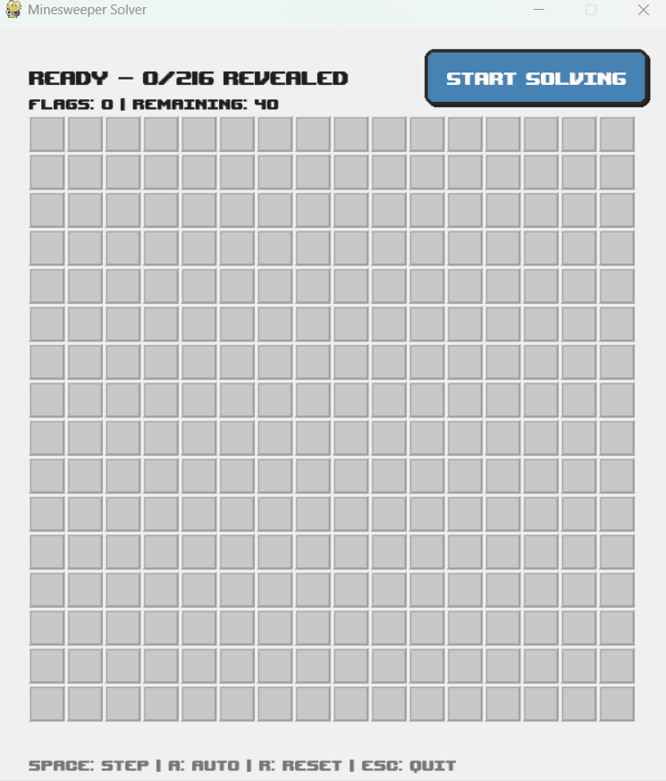
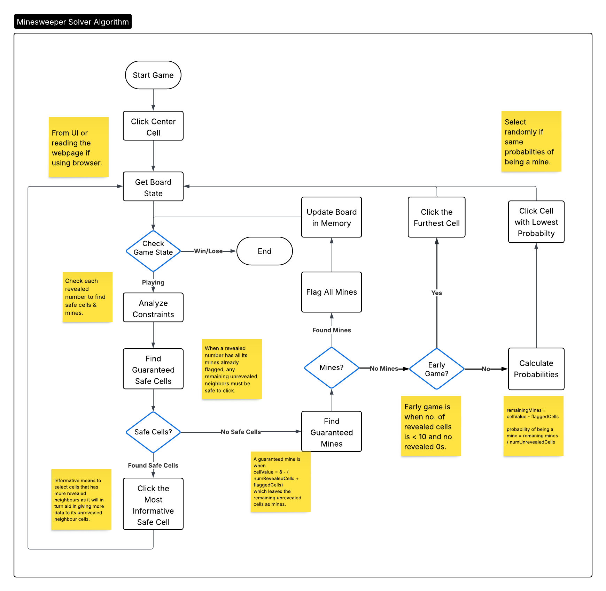

# Minesweeper Solver

Automated Minesweeper solver using browser automation/pygame and logical deduction.



## Installation

```bash
pip install -r requirements.txt
playwright install chromium
```

or

```bash
pip install uv
uv sync
playwright install chromium
```

## Usage

```bash
python main.py
python main.py -m ui
python main.py -m cmd
```

Launches a pygame UI or command prompt that lets you select between:

- Minesweeper via Browser at minesweeper.online or freeminesweeper.org
- Simulated CLI
- Pygame GUI visualization

## Features

- Minesweeper Solver via Logical Deduction
- Browser automation with Playwright
- Simulated environment for testing
- Pygame GUI visualization

## Mine Solving Process



The algorithm works by following these few rules/assumptions:

- If the number of neighbouring flags is equal to the value of a given cell, the rest of the cells must be safe to click on.
- If the number of revealed cells is equal to eight minus the value of the cell, the rest of the cells must be mines.
- If there are no guaranteed cells, get all the neighbouring unrevealed cells and calculate the probability of them being a mine based on their neighbouring revealed cells.
